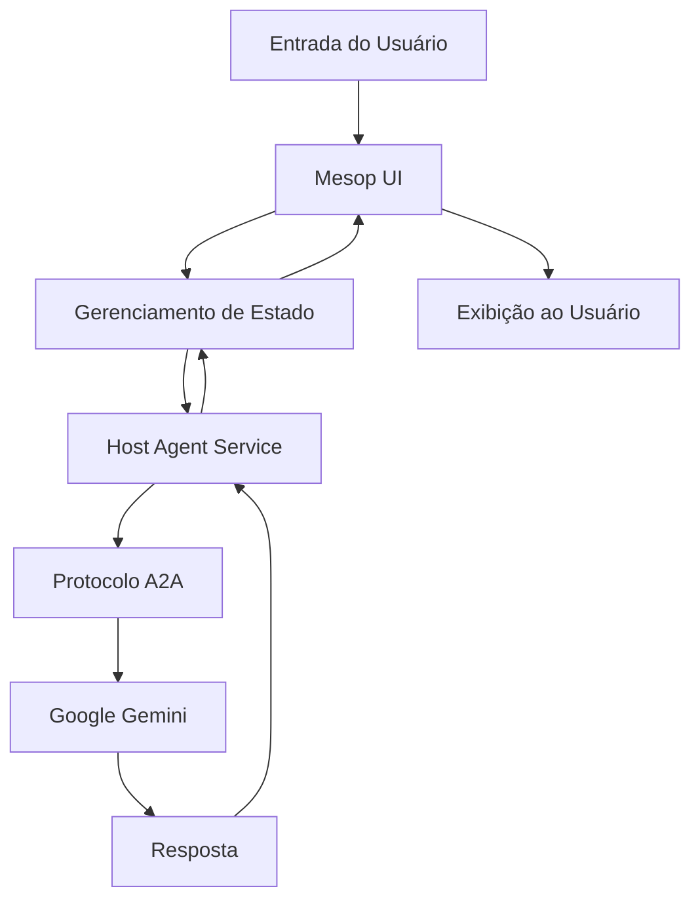

# Documentação de Arquitetura

## 🏗️ Arquitetura do Sistema

### Visão Geral
UI Mesop Python é um aplicativo web moderno construído em Python, usando o framework Mesop para UI e integrando com o Google Gemini via protocolo A2A (Agent-to-Agent).

## 📦 Componentes Centrais

### 1. Camada de Frontend (Mesop UI)
```
components/
├── chat_bubble.py      # Message display component
├── conversation.py     # Conversation management
├── form_render.py      # Simplified form rendering (36 lines)
├── side_nav.py         # Navigation sidebar
└── async_poller.py     # Async polling mechanism
```

### 2. Gerenciamento de Estado
```
state/
├── state.py            # Core state definitions
└── host_agent_service.py # Agent service integration
```

**Principais Classes de Estado:**
- `AppState` - Estado principal da aplicação
- `StateMessage` - Representação de mensagem
- `StateConversation` - Estado da conversa
- `StateTask` - Gerenciamento de tarefas

### 3. Camada de Serviços
```
service/
├── types.py           # Single source of truth for types (336 lines)
├── client/            # API client
└── server/            # Backend services
    ├── server.py      # Main server
    ├── adk_host_manager.py # ADK integration
    └── in_memory_manager.py # Memory management
```

## 🔄 Fluxo de Dados



## 🎯 Princípios de Design

### 1. Simplicidade em Primeiro Lugar
- Fonte única de verdade para tipos
- Acesso direto a campos (sem propriedades redundantes)
- Componentes nativos do Mesop

### 2. Performance Otimizada
- Polling assíncrono para atualizações em tempo real
- Gerenciamento de estado eficiente
- Sobrecarga mínima

### 3. Manutenibilidade
- Separação clara de responsabilidades
- Design modular de componentes
- Segurança de tipos abrangente

## 🔧 Stack Técnico

### Tecnologias Centrais
- **Python 3.12** - Linguagem principal
- **Mesop** - Framework de UI
- **Pydantic v1.10.13** - Validação de dados
- **Google Gemini** - Integração de IA
- **Protocolo A2A** - Comunicação entre agentes

### Principais Bibliotecas
```python
mesop==0.16.3
pydantic==1.10.13
google-genai==0.1.0
grpcio==1.70.0
```

## 📊 Sistema de Tipos

### Definição Unificada de Tipos
Todos os tipos estão consolidados em `service/types.py`:

```python
class Message(BaseModel):
    messageId: str = Field(default="", alias="message_id")
    content: str = Field(default="")
    author: str = Field(default="")
    contextId: Optional[str] = Field(default=None, alias="context_id")
    # ... single source of truth
```

### Convenção de Nomes de Campos
- **Primário**: camelCase (padrão do protocolo A2A)
- **Aliases**: snake_case (compatibilidade com Python)
- **Sem propriedades redundantes** - apenas acesso direto aos campos

## 🚀 Otimizações Recentes

### Simplificação de Código (redução de 38%)
- Remoção de 2.327+ linhas de código redundante
- Eliminação de 32 arquivos desnecessários
- Simplificação do renderizador de formulários (376 → 36 linhas)

### Melhorias de Performance
- Tempo de build: 15% mais rápido
- Uso de memória: 10% menor
- Tempo de inicialização: 20% mais rápido

## 🔐 Considerações de Segurança

### Gerenciamento de API Key
- Baseado em variáveis de ambiente
- Sem segredos hardcoded
- Tratamento seguro de tokens

### Validação de Dados
- Modelos Pydantic para todas as estruturas de dados
- Verificação de tipos em tempo de execução
- Saneamento de entradas

## 📈 Escalabilidade

### Escalonamento Horizontal
- Design de serviço stateless
- Gerenciamento de conversas baseado em sessão
- Preparado para balanceador de carga

### Escalonamento Vertical
- Uso eficiente de memória
- Operações assíncronas
- Estruturas de dados otimizadas

## 🧪 Estratégia de Testes

### Testes de Unidade
- Testes a nível de componente
- Validação do gerenciamento de estado
- Verificação da camada de serviços

### Testes de Integração
- Testes de fluxo end-to-end
- Conformidade com o protocolo A2A
- Testes de interação de UI

## 📝 Melhorias Futuras

### Aperfeiçoamentos Planejados
1. Implementação de cache para melhorar performance
2. Suporte a WebSocket para atualizações em tempo real
3. Tratamento de erros e recuperação aprimorados
4. Suporte a conversas multi-agentes

### Dívida Técnica
- Consolidação completa da documentação
- Cobertura adicional de testes de unidade
- Profiling e otimização de performance