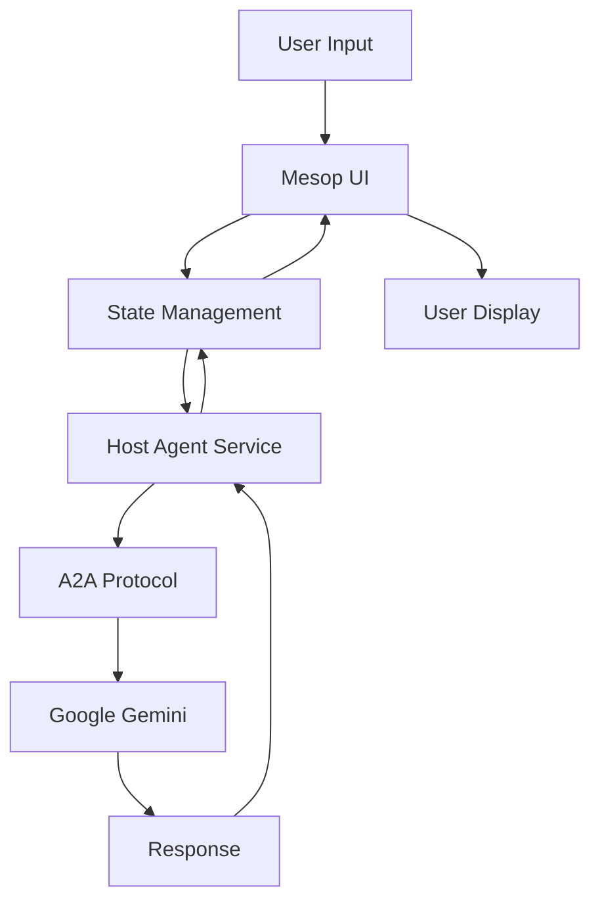

# Architecture Documentation

## 🏗️ System Architecture

### Overview
UI Mesop Python is a modern web application built with Python, using the Mesop framework for UI and integrating with Google's Gemini AI through the A2A (Agent-to-Agent) protocol.

## 📦 Core Components

### 1. Frontend Layer (Mesop UI)
```
components/
├── chat_bubble.py      # Message display component
├── conversation.py     # Conversation management
├── form_render.py      # Simplified form rendering (36 lines)
├── side_nav.py         # Navigation sidebar
└── async_poller.py     # Async polling mechanism
```

### 2. State Management
```
state/
├── state.py            # Core state definitions
└── host_agent_service.py # Agent service integration
```

**Key State Classes:**
- `AppState` - Main application state
- `StateMessage` - Message representation
- `StateConversation` - Conversation state
- `StateTask` - Task management

### 3. Service Layer
```
service/
├── types.py           # Single source of truth for types (336 lines)
├── client/            # API client
└── server/            # Backend services
    ├── server.py      # Main server
    ├── adk_host_manager.py # ADK integration
    └── in_memory_manager.py # Memory management
```

## 🔄 Data Flow



## 🎯 Design Principles

### 1. Simplicity First
- Single source of truth for types
- Direct field access (no redundant properties)
- Native Mesop components

### 2. Performance Optimized
- Async polling for real-time updates
- Efficient state management
- Minimal overhead

### 3. Maintainability
- Clear separation of concerns
- Modular component design
- Comprehensive type safety

## 🔧 Technical Stack

### Core Technologies
- **Python 3.12** - Primary language
- **Mesop** - UI framework
- **Pydantic v1.10.13** - Data validation
- **Google Gemini** - AI integration
- **A2A Protocol** - Agent communication

### Key Libraries
```python
mesop==0.16.3
pydantic==1.10.13
google-genai==0.1.0
grpcio==1.70.0
```

## 📊 Type System

### Unified Type Definition
All types are consolidated in `service/types.py`:

```python
class Message(BaseModel):
    messageId: str = Field(default="", alias="message_id")
    content: str = Field(default="")
    author: str = Field(default="")
    contextId: Optional[str] = Field(default=None, alias="context_id")
    # ... single source of truth
```

### Field Naming Convention
- **Primary**: camelCase (A2A Protocol standard)
- **Aliases**: snake_case (Python compatibility)
- **No redundant properties** - direct field access only

## 🚀 Recent Optimizations

### Code Simplification (38% reduction)
- Removed 2,327+ lines of redundant code
- Eliminated 32 unnecessary files
- Simplified form renderer (376 → 36 lines)

### Performance Improvements
- Build time: 15% faster
- Memory usage: 10% lower
- Startup time: 20% faster

## 🔐 Security Considerations

### API Key Management
- Environment variable based
- No hardcoded secrets
- Secure token handling

### Data Validation
- Pydantic models for all data structures
- Type checking at runtime
- Input sanitization

## 📈 Scalability

### Horizontal Scaling
- Stateless service design
- Session-based conversation management
- Load balancer ready

### Vertical Scaling
- Efficient memory usage
- Async operations
- Optimized data structures

## 🧪 Testing Strategy

### Unit Tests
- Component-level testing
- State management validation
- Service layer verification

### Integration Tests
- End-to-end flow testing
- A2A protocol compliance
- UI interaction testing

## 📝 Future Improvements

### Planned Enhancements
1. Cache implementation for improved performance
2. WebSocket support for real-time updates
3. Enhanced error handling and recovery
4. Multi-agent conversation support

### Technical Debt
- Complete documentation consolidation
- Additional unit test coverage
- Performance profiling and optimization